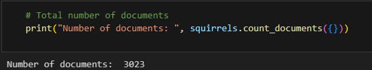
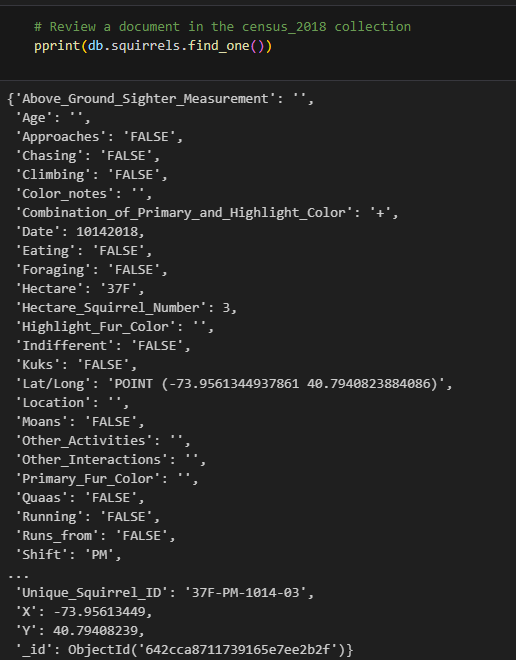
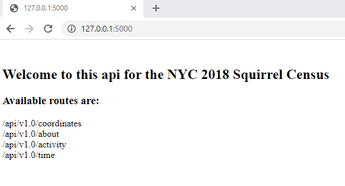
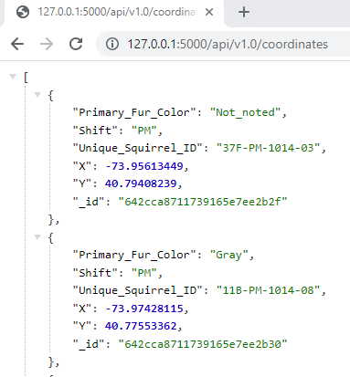

# Dashboard for data visualisation and exploration

## **Overview**
 Full stack development to build an interactive dashboard exploring squirrels in Central Park New York.
 
## **Data**
Data used was from the [2018 Central Park Squirrel Census](https://data.cityofnewyork.us/Environment/2018-Central-Park-Squirrel-Census-Squirrel-Data/vfnx-vebw).

## **Aspects covered**
There were four key stages in developing the dashboards:
1. Create a MongoDB database to hold the squirrel data
2. Clean the data and perform exploratory analysis
3. Create a flask api containing various routes holding the required data
4. Create the interactive dashboard

Additional detail on each stage is provided below.

---
### **Stage 1 - Create a MongoDB database and loaded the squirrels census data into it**
- A database was set up in MongoDBCompass, with the dataset imported with the code `mongoimport --type csv -d squirrels_db -c squirrels --headerline  --drop 2018_Central_Park_Squirrel_Census_-_Squirrel_Data.csv`
- Total number of documents loaded

<!-- - Viewing a document in the collection
 -->
---
### **Stage 2 - Clean and explore the data**
- Pymongo was used to connect to the database to review the data and update fields.
- One notable aspect identified was five squirrels with duplicate ID's, each appearing twice.  
    - On review data for each duplicate unique squirrel ID was the same, except for longitude and latitude values, which differed slightly.  
    - As there was no way to verify the duplicate ID's the decision was made to keep them in the data, as there was not a clear reason to exclude them.  Also as it was 5 records out of 3023, it was felt it would have minimal impact on the data.
- Numerous fields (such as primary fur color, age, location highlight fur colour) had missing data.  This was updated with 'not_noted' in the database.
---
### **Stage 3 - Create a flask api**
- The purpose of this was so that the dashboard could draw off data contained within the flask api.
- Four app routes were set up, each containing different aspects of data required for the dashboards.

- Below is an example of the information contained in the coordinates route, as different layers were being used in the heat map, this information was stored alongside the longitude and latitude data.

---
### Stage 4 - Create an interactive dashboard
- Javascript was used to reference data contained in the flask api to display on a web page via html and css.
- Charts in the dashboard were designed to be interactive for users:
    - Select different layers on the heat map
    - Click on and off the bars on the radial charts
    - Select the time of day to display data on squirrel activity.
- Below is an image of the created webpage

 

---

### **Contact**
Email: kymcoleman@gmail.com

---